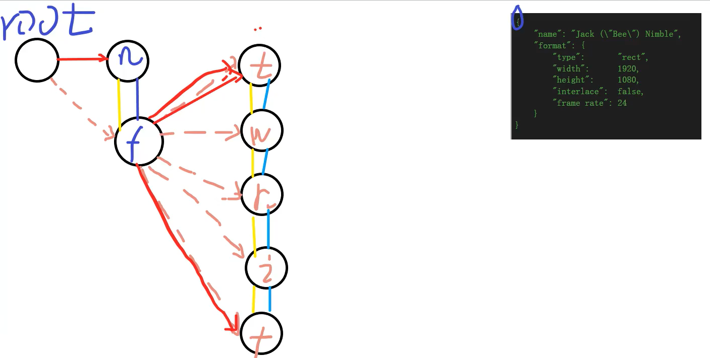

### 1、实现架构图
```shell
实现
```




```c

/*
可能会有多个文件同时包含一个头文件，当这些文件编译链接成一个可执行文件时
，就会出现大量“重定义”的错误。在头文件中实用#ifndef #define #endif能避免头文件的重定义。
例如要编写头文件test.h
在头文件开头写上两行：
	#ifndef _TEST_H
	#define _TEST_H//一般是文件名的大写
头文件结尾写上一行：#endif
     这样一个工程文件里同时包含两个test.h时，就不会出现重定义的错误了。
        分析：当第一次包含test.h时，由于没有定义_TEST_H，条件为真，这样就会包含（执行）#ifndef _TEST_H和#endif之间的代码，当第二次包含test.h时前面一次已经定义了_TEST_H，条件为假，#ifndef _TEST_H和#endif之间的代码也就不会再次被包含，这样就避免了重定义了
 * /
```
### 解析01
```c
#pragma once

#ifndef _CJSON_H_
#define _CJSON_H_

/*
两个板块：
json解析、节点的增删改查

{
	"name": "Jack (\"Bee\") Nimble",
	"format": {
		"type":       "rect",
		"width":      1920,
		"height":     1080,
		"interlace":  false,
		"frame rate": 24
	}
}
0
逻辑上的树状结构

root ---> child(name)
				format--->child(type)
								width
								height
								interlace
								frame rate
*/
/*
value 类型
*/
#define cJSON_False 0
#define cJSON_True 1
#define cJSON_NULL 2
#define cJSON_Number 3
#define cJSON_String 4
#define cJSON_Array 5
#define cJSON_Object 6

/*
功能：创建一个string值为name的cJSON_False节点，并添加到object
*/
#define cJSON_AddFalseToObject(object, name) \
	cJSON_AddItemToObject(object, name, cJSON_CreateFalse())

/*创建一个string值为name的cJSON_True节点,并添加到object节点*/
#define cJSON_AddTrueToObject(object, name) \
	cJSON_AddItemToObject(object, name, cJSON_CreateTrue())

/*创建一个string值为name的cJSON_Bool/False节点,并添加到object节点*/
#define cJSON_AddBoolToObject(object, name, b) \
	cJSON_AddItemToObject(object, name, cJSON_CreateBool(b))

/*创建一个string值为name的cJSON_NULL节点,并添加到object节点*/
#define cJSON_AddNULLToObject(object, name) \
	cJSON_AddItemToObject(object, name, cJSON_CreateNull())

/*创建一个string值为name的cJSON_Number节点,并添加到object节点*/
#define cJSON_AddNumberToObject(object, name, number) \
	cJSON_AddItemToObject(object, name, cJSON_CreateNumber(number))

/*创建一个string值为name的cJSON_String节点,并添加到object节点*/
#define cJSON_AddStringToObject(object, name, s) \
	cJSON_AddItemToObject(object, name, cJSON_CreateString(s))

/*修改值*/
#define cJSON_SetIntValue(object, val) \
	/*如果object存在，设置为va*/
	((object) ? ((object)->valueInt = (object)->valueDouble = (val)) : (val))

#define cJSON_SetNumberValue(object, val) \
	((object) ? ((object)->valueInt = (object)->valueDouble = (val)) : (val))

typedef struct  cJSON
{
	struct cJSON *next, *prev;
	struct cJSON *child;

	/*array以及obect类型需要设立子节点*/
	int type;
	char *valueString;
	int valueInt;
	double valueDouble;

	/*
	保存节点名称
	*/
	char *string;
} cJSON;

/*常用解析函数*/

/*
函数功能：
	解析json数据，将数据填入json树中
	将字符串解析成结构体
参数：
	value (const char *):char*指针，指向待解析的json数据
返回值：
	json树的根节点
*/
cJSON *cJSON_Parse(const char *value);

/*
函数功能：
	从item节点开始递归遍历，将节点树转换为字符串
	将json数据转换成本字符串
参数：
	item(cJSON *item):cJson节点
返回值：
	字符串指针，从item节点解析后的树字符串
注意事项：
	使用该函数后，需要根据返回的char*指针释放内存。
	out = cJSON_Print(cJSON *item)
	prinf("%s",out);
	free(out)
*/
char *cJSON_Print(cJSON *item);

/*
函数功能：
	从根节点开始递归删除json树各个及诶单，示范内存
参数：
	c(cJson *c):cJSON节点
返回值：
	void 不需要返回值
*/
void cJSON_Delete(cJSON *c);

/*
函数功能：
	创建一个cJSON节点，并设置节点类型为cJSON_Object
参数：
	void
返回值：
	cJson_Object 类型的节点指针。
*/
cJSON *cJSON_CreateObject(void);

/*
函数功能：
	创建一个cJSON节点，并设置节点类型为cJSON_String
参数：
	string(char *string)
返回值：
	cJSON_String 类型的节点指针
*/
cJSON *cJSON_CreateString(const char *string);

/*
函数功能：
	创建一个cJSON节点，并设置节点类型为cJSON_Number
参数：
	num(double)
返回值：
	cJSON_Number 类型的节点指针
*/
cJSON *cJSON_CreateNumber(double num);

/*
函数功能：
	创建一个cJSON节点，并设置节点类型为cJSON_Array
参数：
	void
返回值：
	cJSON_Array 类型的节点指针
*/
cJSON *cJSON_CreateArray(void);

/*
函数功能：
	创建一个cJSON节点，并设置节点类型为cJSON_Bool
参数：
	void
返回值：
	cJson_Bool 类型的节点指针
*/
cJSON *cJSON_CreateBool(int b);

/*
函数功能：
	创建一个cJSON节点，并设置节点类型为cJSON_True
参数：
	void
返回值：
	cJSON_True 类型的节点指针
*/
cJSON *cJSON_CreateTrue(void);

/*
函数功能：
	创建一个cJSON节点，并设置节点类型为cJSON_False
参数：
	void
返回值：
	cJSON_False 类型的节点指针
*/
cJSON *cJSON_CreateFalse(void);

/*
函数功能：
	创建一个cJSON节点，并设置节点类型为cJSON_Null
参数：
	void
返回值：
	cJSON_Null 类型的节点指针
*/
cJSON *cJSON_CreateNull(void);

/*
函数功能：
	将item节点名称设置为string，
	如果object节点没有子节点，就将item设置为object节点的子节点
	否则将item添加到object->child链表尾部，成为object子节点的兄弟节点
参数：
	object(cJSON *):被添加节点
	string(char *)：要添加的节点的名称
	item(cJSON *)：要添加的节点
返回值：
	void
*/
void cJSON_AddItemToObject(cJSON *object, const char *string, cJSON *item);

/*
函数功能：
	将item添加到array节点
参数：
	array(cJSON *):被添加节点
	item(cJSON *)：要添加的节点
返回值：
	void
*/
void cJSON_AddItemToArray(cJSON *array, cJSON *item);

cJSON *cJSON_ParseWithOpts(const char *value, const char **return_parse_end, int require_null_terminated);

cJSON *cJSON_New_Item();

const char *skip(const char *in);
char *cJSON_GetEndPosition(void);

const char *parse_value(cJSON *item, const char *value);

const char *parse_string(cJSON *item, const char *str);
const char *parse_number(cJSON *item, const char *num);
const char *parse_Array(cJSON *item, const char *value);
const char *parse_Object(cJSON *item, const char *value);

char *cJSON_strdup(const char *str);
char *print_number(cJSON *item);
char *print_string(cJSON *item, int isName);
// char *print_string(cJSON *item);

//["OSCAR",123,XXX]
char *print_array(cJSON *item, int depth, int fmt);
char *print_object(cJSON *item, int depth, int fmt);
char *print_value(cJSON *item, int depth, int fmt);

cJSON *cJSON_DetachItemFromArray(cJSON *array, int which);
void cJSON_DeleteItemFromArray(cJSON *array, int which);

int cJSON_strcasecmp(const char *s1, const char *s2); // strcmp()

cJSON *cJSON_DetachItemFromObject(cJSON *object, const char *string);
void cJSON_DeleteItemFromObject(cJSON *object, int which);

void cJSON_InsertItemInArray(cJSON *array, int which, cJSON *newItem);

void cJSON_ReplaceItemInArray(cJSON *array, int which, cJSON *newItem);
void cJSON_ReplaceItemInObject(cJSON *object, const char *string, cJSON *newItem);

#endif // !_CJSON_H_

```