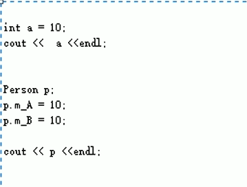
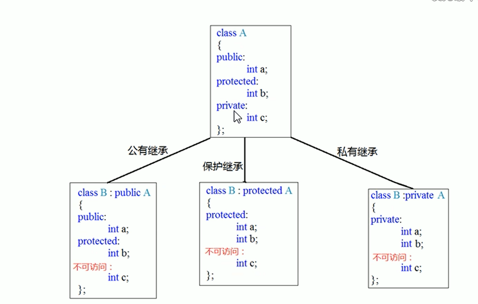
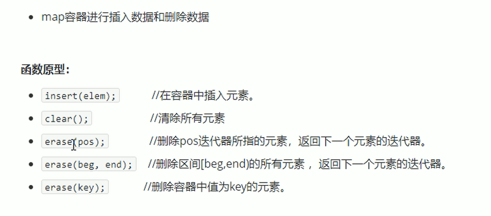

<!--
 * @Descripttion: 
 * @version: 
 * @Author: Gao
 * @Date: 2023-12-08 17:08:23
 * @LastEditors: Gao
 * @LastEditTime: 2024-01-08 10:51:40
-->

### 左右运算符重载

问题

解决方法：
重载<<运算符

### 继承

### 多态

静态多态：函数重载 和运算符重载属于静态多态，复用函数名
动态多态：排生类和虚函数实现运行时多态

静态多态的函数地址早绑定 - 编译阶段确定函数地址
动态多态的函数地址晚绑定 - 运行阶段确定函数地址

